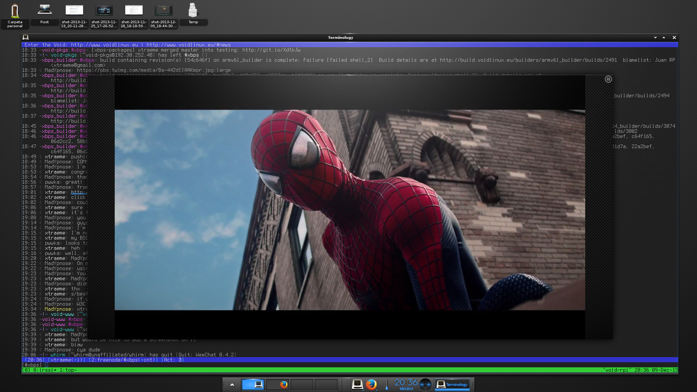

+++
title="E18 RC1 has been pushed to the official repository"
date=2013-12-09
+++

The Enlightenment 0.18 release (aka E18) will be soon released and it's
currently in the Release Candidate 1 phase. To anticipate the release
I've updated Enlightenment and EFL related components to the latest released
versions available:

 - EFL 1.8.2
 - Elementary 1.8.1
 - Evas Generic Loaders 1.8.1
 - Emotion Generic Players 1.8.0
 - Enlightenment 0.18.0-rc1
 - Python EFL bindings 1.8.0

To install it simply install the `enlightenment` package:

```
# xbps-install -Sy enlightenment
```

A screenshot of my E18 desktop:

[](e18-rc1-xtraeme.jpg)
