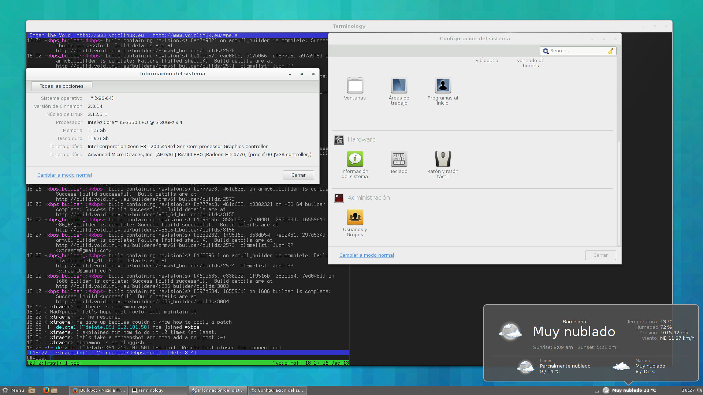

+++
title="Cinnamon 2.x desktop now available"
date=2013-12-16
+++

By popular demand (1 user) I've packaged the Cinnamon desktop (again),
which is a fork of GNOME3 developped for the Linux Mint distribution.

To install it simply install the `cinnamon` package, i.e:

    # xbps-install -Sy cinnamon

If something does not work correctly please submit new issues at
[https://github.com/voidlinux/xbps-packages/issues](//github.com/voidlinux/xbps-packages/issues).

Here's a screenshot of Cinnamon running on my x86_64 machine:

