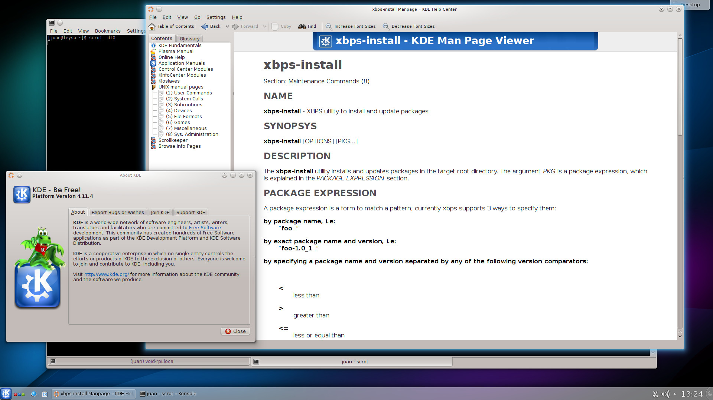

+++
title="KDE 4.11.4 now available"
date=2013-12-17
+++

I've updated KDE to the latest stable version available: 4.11.4. The base packages
for a minimal KDE are now available, but please note that many applications are
not still packaged. Please join irc to help in providing more KDE applications.

To install it simply install the `kde` package, i.e:

```
# xbps-install -Sy kde
```

To enable `kdm` at boot:

```
# systemctl enable kdm -f
```

If something does not work correctly please submit new issues at
[https://github.com/voidlinux/xbps-packages/issues](//github.com/voidlinux/xbps-packages/issues).

Here's a screenshot of KDE 4.11.4 running on my x86_64 machine:

[](kde-4.11.4.jpg)
