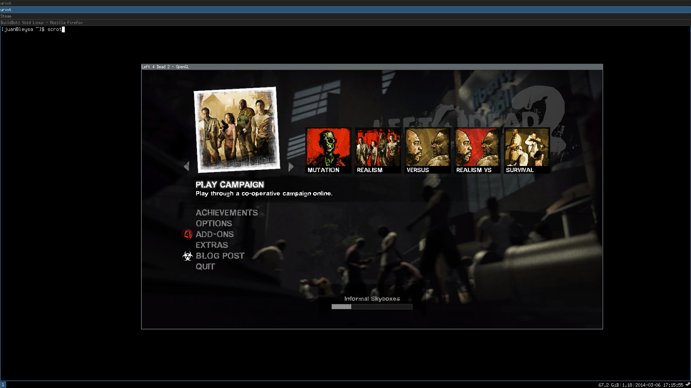

+++
title="Valve's steam client now available for x86_64"
date=2014-03-06
+++

Valve's steam client is now available for x86\_64. Thanks to the recent improvements
made to xbps-src, we are now able to build 32bit pkgs for x86\_64 by reusing the
same unmodified build template files.

To install and run steam with Void on x86\_64, follow these steps:

```
# Make sure that all pkgs are up-to-date.
# xbps-install -Syu
```

Uncomment the *nonfree* repository from `/etc/xbps/xbps.conf`:

```
http://repo.voidlinux.eu/current/nonfree
```

And then install steam and required 32bit packages:

```
# Where XXX might be: amd, intel or nouveau.
# xbps-install -Sy libGL-32bit libpulseaudio-32bit libtxc_dxtn-32bit mesa-XXX-dri-32bit steam
```

A screenshot of L4D2 running on my system (CPU i5 3550, Intel HD2500, Mesa 10.1):

[](steam-x86_64.jpg)
