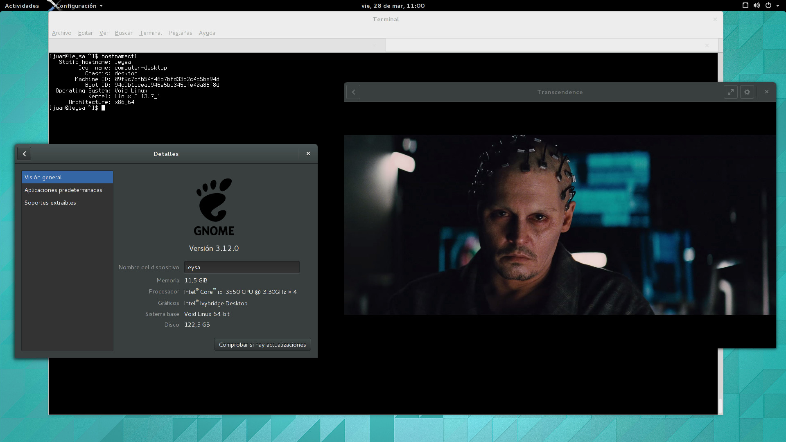

+++
title="GNOME 3.12 now available!"
date=2014-03-28
+++

The latest and greatest GNOME major version is now available for the Void distribution.

It took me some hours to update all packages to achieve a complete GNOME 3.12 desktop.

Remember that maintaining a distribution and a genuine complete package system
is time consuming; if you appreciate my work to have the latest and greatest software
available before any other distribution, please help me with donations or contributions
to the wiki, packages, etc.

A screenshot of GNOME 3.12 running on my system (CPU i5 3550, Intel HD2500, Mesa 10.1):

