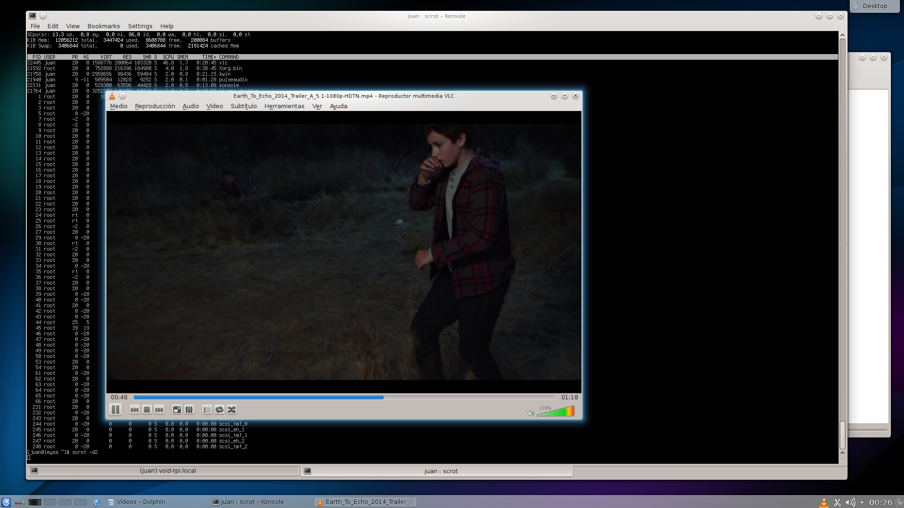

+++
title="KDE SC 4.13.3 now available"
date=2014-08-06
+++

The [KDE SC](http://www.kde.org) packages have been updated to the latest stable
version available: **4.13.3**.

The packages have been adapted to be used with **runit** and **ConsoleKit**,
and support *suspend/hibernation*, and *fast user switching*.

To install it and enable **KDM**:

	# xbps-install -Sv kde
	# ln -s /etc/sv/dbus /var/service/
	# ln -s /etc/sv/kdm /var/service/

A screenshot of my KDE desktop:

