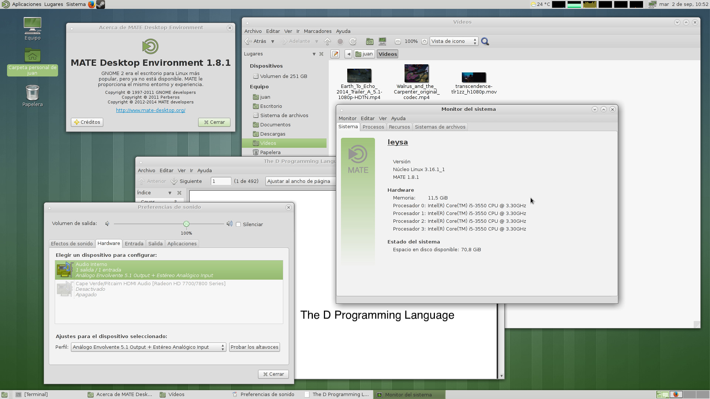

+++
title="MATE desktop 1.8.1 now available"
date=2014-09-02
+++

The [MATE desktop environment](http://www.mate-desktop.org) has been packaged by yours truly
and we've got now the latest available version: **1.8.1**.

This DE supports **suspend/hibernation/fast-user-switching** with no additional changes, thanks
to **ConsoleKit** and **upower (0.9.x)**.

The minimal **MATE** desktop is available in the **mate** meta-package, and all its
extra applications (Atril, Pluma, applets, etc) are in the **mate-extra** package.
For additional functionality the **ConsoleKit** and **upower0** packages must also be
installed.

To install all **MATE** packages with full functionality:

	# xbps-install -Sv mate mate-extra ConsoleKit upower0
	# ln -s /etc/sv/dbus /var/service/

Use **mate-session** to start it via **~/.xinitrc** or select it in your Display Manager.

A screenshot of my MATE desktop:

