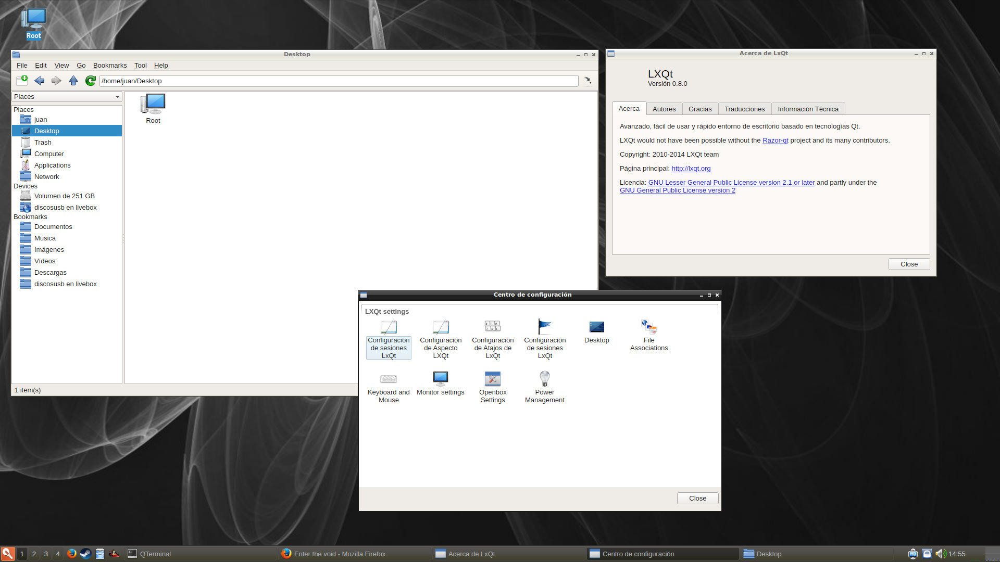

+++
title="LXQt 0.8.0 Desktop Environment now available"
date=2014-11-03
+++

The [LXQt desktop environment](http://www.lxqt.org) has been packaged by yours truly
and we've now got the latest available version: **0.8.0**.

To install a complete **LXQt** package with full functionality:

	# xbps-install -S lxqt

Use **startlxqt** to start it via **~/.xinitrc** or select it in your Display Manager.

A screenshot of my **LXQt** desktop:

