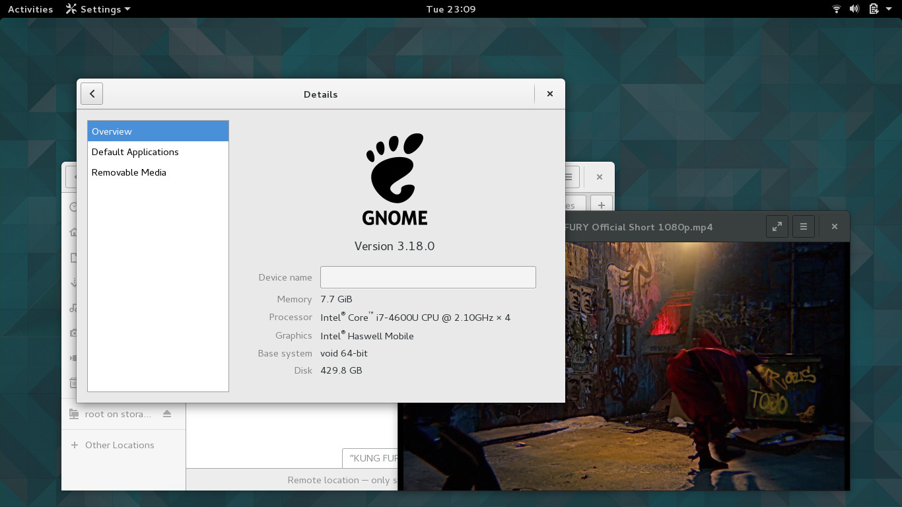

+++
title="GNOME 3.18 now available!"
date=2015-08-29
+++

Autumn is coming. And so is a new <a href="http://gnome.org/">GNOME</a> release!
This time it took us only a week from the release to get it packaged.

Thanks to <a href="https://twitter.com/Gottox">Enno Boland</a> who put together
<a href="https://github.com/voidlinux/void-packages/pull/2619">this update</a>
containing about 114 commits and 113 package updates.

A screenshot of GNOME 3.18 running on Enno's system (CPU i7 4600U, Intel HD4400, Mesa 11.0):

