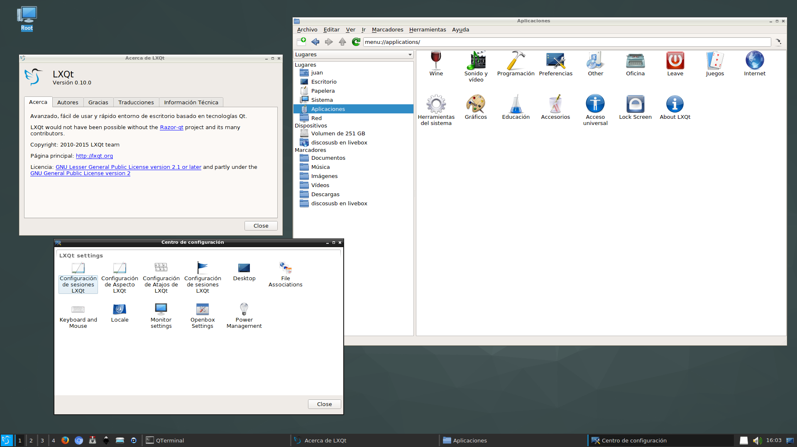

+++
title="LXQt 0.10 now available!"
date=2015-11-02
+++

The LXQt project has just announced the 0.10 version with multiple bugfixes; and now it's
available for Void on i686, x86\_64, and x86\_64 with musl.

A screenshot of LXQt 0.10 running on Juan's system (CPU i5 3550, Intel HD4400, Mesa 11.0.4):

