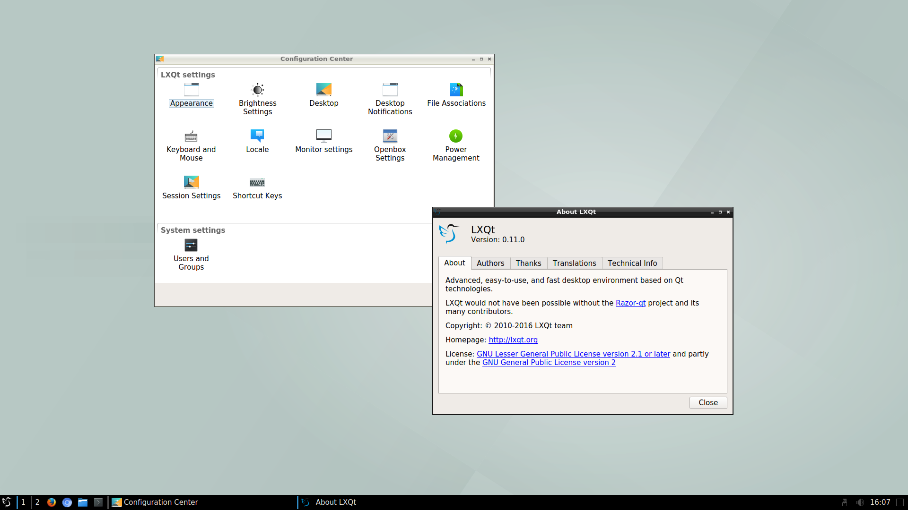

+++
title="LXQt 0.11 now available!"
date=2016-09-29
+++

The LXQt project has just announced the 0.11 version with multiple
bugfixes and it's now available for Void on i686, x86\_64, and x86\_64
with musl.

A screenshot of LXQt 0.11 running on Void:

