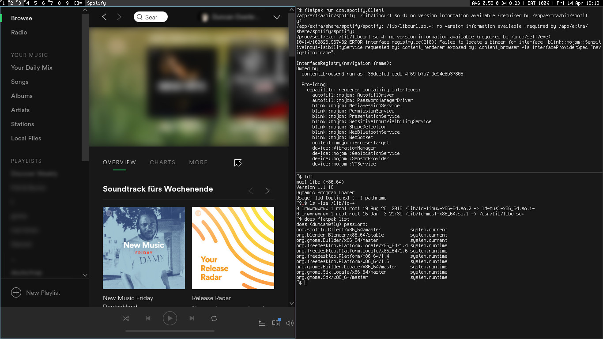

+++
title="Flatpak"
date=2017-04-14
+++

Today we merged [Flatpak](http://flatpak.org) into the repository for all
supported architectures and both libc implementations (`musl` and `glibc`).

Flatpak provides a simple and user-friendly way to run, update and create
self-contained desktop applications.

It is possible to run proprietary, big and bloated software like Skype or Spotify
on a lightning fast and sleek musl based Void Linux system.

