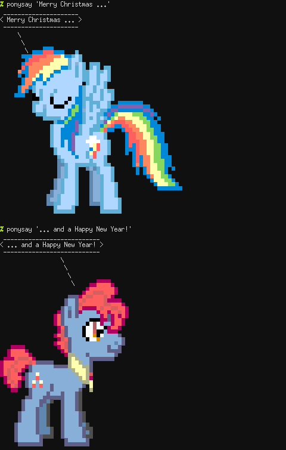

+++
title="The Advent of Void: Day 25: ponysay"
date=2017-12-25
+++

Who of you ever wanted a pony for Christmas?
Turns out, Void Linux already includes some.  Don't worry,
they are just virtual yet just a command away:

```
# xbps-install ponysay
```



[ponysay](https://man.voidlinux.eu/ponysay.6) features over 400
illustrations of My Little Pony for your terminal.
Look at all of them using

```
% ponysay-tool --browse /usr/share/ponysay/ponies
```

You even can make the ponies quote themselves using `ponysay -q`.

Lots of fun for everypony! Whee!
