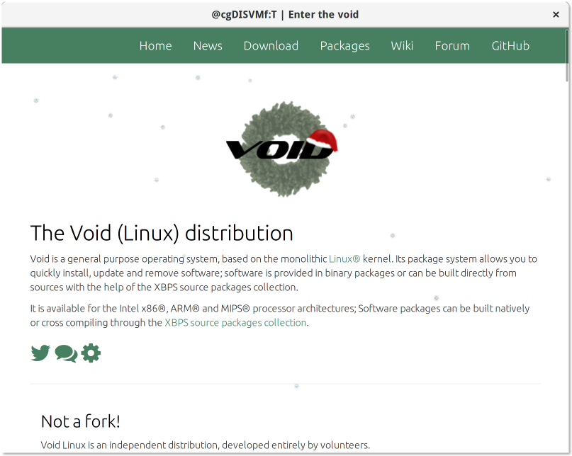

+++
title="The Advent of Void: Day 5: surf"
date=2018-12-05
+++

Note: the author of this article is the former maintainer of the surf browser.

[surf(1)](https://man.voidlinux.org/surf) is a simplistic webkit2 based browser.
The characteristic that sets surf appart from other browsers are the features it
lacks. surf neither has support for bookmarks nor browser history nor plugins.
That leads to a very different workflow in contrast to other browsers.

With browsers like Firefox or Chrome you open the browser once and leave it
there. With surf it's intended to call it from command line, do a task and close
the browser once you finished. It's much like using a pdf reader for websites.
This leads to a distraction free and focused experience.

To visit the voidlinux homepage just open:

```
$ surf voidlinux.org
```



You can use vi-like keybindings like `Ctrl-h` and `Ctrl-l` to go back and forth
in the browser history and use `Ctrl-j` and `Ctrl-k` to scroll up and down.

It supports a user defined javascript file to alter the look of pages to your
needs. For that create `~/.surf/script.js` and add javascript in there. This
code will be called on every new page that is opened in surf.

Similiar the browser also support custom stylesheets. For that create a new
file with the name `~/.surf/styles/default.css` This css file will be loaded and
allows to set custom color themes for websites.

surf has a comprehensive [manual page](https://man.voidlinux.org/surf) and for
further reading you can also visit the [website](http://surf.suckless.org/).
