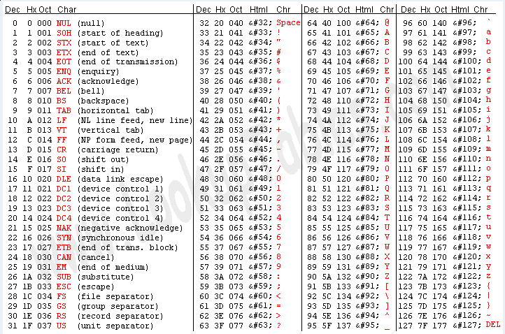
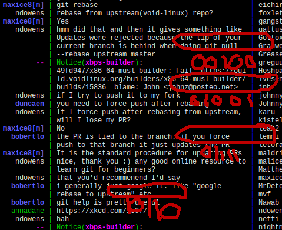

+++
title="The Advent of Void: Day 24: gromit-mpx"
date=2018-12-24T01:00:00Z
+++

Have you ever wanted to doodle on a screenshot? Ever? Just a single underline,
or an arrow, or something to help point out something about a screenshot? Or
maybe during a presentation, on the fly, suddenly you want to point out
a particular thing... wouldn't it be nice to have a tool to help?

Turns out, there is one, a very simple tool to do this. I use it every
month.

Gromit-mpx is simple. `<F9>` to start being able to draw, `Shift-Ctrl-<F9>` to
clear everything you drew, and `Ctrl-<F9>` to stop being able to draw (but
leave everything on the screen). Just make sure `gromit-mpx` is running in the
background, and you are set for all your drawing and annotating needs. Even
people like me, who just run `dwm` and not with any compositor, I can annotate
my screen quickly.

But with just a few lines, I can clarify what I meant to share. I won't be
winning any art awards, but it works.

Do note that the annotations stick around, even after you scroll the window, or
switch to a different screen entirely.

So keep `gromit-mpx` around, it might be useful someday.

For more information, there is always the
[gromit-mpx(1) manpage](https://man.voidlinux.org/1/gromit-mpx).
